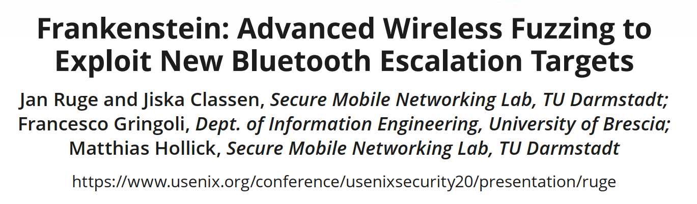
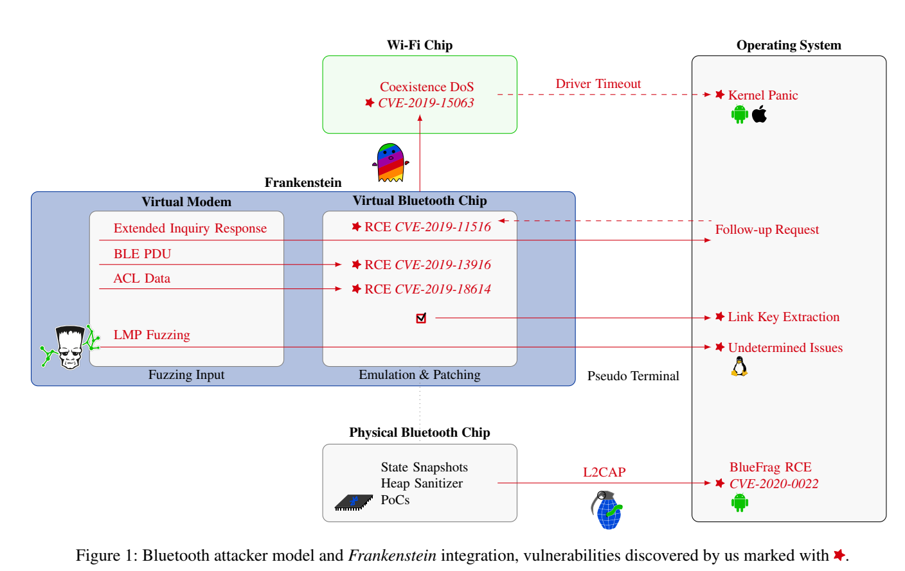
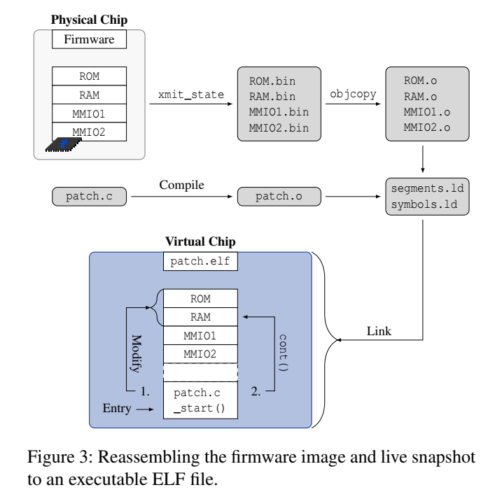

# Frankenstein: Advanced Wireless Fuzzing to Exploit New Bluetooth Escalation Targets

今天为大家推荐来自Secure Mobile Networking Lab, TU Darmstadt的针对蓝牙协议的模糊测试工作：Frankenstein: Advanced Wireless Fuzzing to Exploit New Bluetooth Escalation Targets，
该工作收录于29th USENIX Security Symposium.

长久以来，无线通讯协议的设计和实现安全问题一直困扰着开发者。由于大多数固件实现是闭源的，所以模糊测试（fuzzing）仍然是寻找部署的系统中的远程代码执行（RCE）漏洞的主要方法。现有的over-the-air fuzzing手段有显著的缺点，比如测试速率、可重复性以及debug能力方面的限制。

本文中，作者提出了Frankenstein——一种基于固件仿真的fuzzing框架，有效解决了上述模糊测试技术的缺点。Frankenstein选择利用固件转储（firmware dump)，并为虚拟的芯片调制解调器（modem）提供测试输入。作者设计的高速fuzzing方法能够与目标操作系统保持互通性，进而触发真实的协议栈行为。

在实验中，作者利用Frankenstein发现了Broadcom和Cypress蓝牙协议栈的3个zero-click漏洞，这些蓝牙芯片被广泛应用在Apple、Samsung和Rasberry Pi等设备中。利用蓝牙芯片的RCE漏洞，攻击者可以将权限提升到突破单个芯片的边界。作者发现了一个由WiFi和蓝牙协议栈共存而导致的漏洞，该漏洞可以引发多种操作系统的内核崩溃。文章还发现了蓝牙5.2协议的设计缺陷，该缺陷可以导致host的link key被非法提取。因为关闭蓝牙并不能完全停止芯片的运行，所以RCE漏洞是难以防御的。此外，通过对其他设备的测试，作者还发现了一个与芯片类型无关的Andriod RCE漏洞BlueFrag。

## 核心贡献

对于Broadcom芯片，作者通过对配对阶段之前能够获得的固件进行系统化fuzzing，找到了对应的蓝牙zero-click RCE漏洞。而Cypress芯片于2016年获取了Broadcom的实现代码，虽然此后二者独立开发，但是针对它们的测试方法是相似的。仿真和fuzzing提供了对没有文档记录的固件的深入分析。作者设计了一套C语言环境来与固件镜像交互，测试假想示例并缩减相关的代码路径。

总体来说，本文的突出贡献主要有如下六点：
1. 设计和实现了仿真框架Frankenstein来运行大部分固件，包括注入无线数据帧和与host交互；
2. 发现3个zero-click芯片漏洞，两个针对经典蓝牙，一个针对BLE；
3. 发现Android系统的BlueFrag漏洞；
4. 攻击WiFi和Bluetooth芯片的共存机制，导致设备需要完全重启，或者引发内核崩溃；
5. 揭露蓝牙5.2协议的一个设计缺陷，允许攻击者通过关闭的连接获取host link key；
6. 证明了用户无法通过关闭蓝牙来进行防御，因为芯片的重启机制没有被正确配置。

## Frankenstein 设计框架

Frankenstein生成物理设备的快照（snapshot），然后用QEMU进行仿真来fuzz整个协议栈。over-the-air数据由一个虚拟的调制解调器发送，仿真的固件实现了线程和任务切换来fuzz多种handler，并连接到一个真实的Linux host。

Frankenstein利用InternalBlue来从Broadcom芯片的ROM中提取固件，并利用Patchram技术进行patch。但是，Patchram技术对硬件的分析能力很有限，考虑到蓝牙协议超过3000页的复杂程度，作者决定在仿真环境中进行fuzzing。
Frankenstein没有采用常见的逆向分析方法来处理闭源固件，而是把固件当做整体来进行fuzz，它包括产生输入的虚拟调制器，并能够将固件连接到Linux BlueZ host。这需要实现中断处理和线程切换，Frankenstein选择将这些功能以C hook的形式插桩到固件中。

CYW20735开发板的处理器为ARM Cortex M4，使用的RTOS为ThreadX。下面以CYW20735开发板为例，介绍Frankenstein的设计框架。

### Bringing Firmware Images Back to Life

在仿真初始化阶段，有一些重要的hook为Frankenstein提供基本信息。`map_memory`hook会改写ARM的内存错误句柄，并记录包括全部寄存器地址的内存分布图。`xmit_state`hook负责记录物理设备的内存快照，包括ROM、RAM、MMIO段等地址空间。

Frankenstein使用标准的用户态QEMU进行仿真，并对固件进行了改动。收集的内存快照是没有符号的二进制文件，因此需要转换为ELF文件，并将用户代码编译链接进固件镜像。由于Frankenstein运行在用户态Linux系统中，不支持中断，因此ThreadX的中断处理函数都被禁用，涉及到特殊硬件和计时器的函数也被替换。此外，用来处理上下文切换的SVC需要在内核模式执行，因此它的handler也被重新实现。

### Hooking for Portability

作者设计了一套轻量的hook机制，用来对固件进行修改，利用Broadcom的Patchram技术，还可以短暂修改ROM中的代码。它允许Frankenstein追踪函数调用、分析中断处理句柄和QEMU、真实硬件上的寄存器状态。例如，对蓝牙LMP协议的fuzzing需要如下几类hook：
1. 线程间的上下文切换；
2. HCI支持；
3. 基于硬件中断的计时器；
4. 大概100个用于debug和实现的hook。

